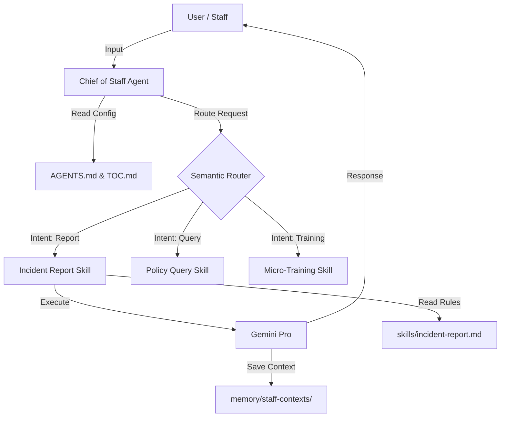

# PocketPA - AI Chief of Staff for Care Homes 🏥✨

> **Status**: Prototype (Week 1)
> **Author**: Ry
> **Architecture**: Mindstone OS (Chief of Staff Pattern)

**PocketPA** is an intelligent, voice-first AI assistant designed to empower care home staff. It reduces administrative burden, ensures compliance, and provides real-time guidance—allowing staff to focus on what matters most: caring for residents.

---

## 🎯 What This Prototype Demonstrates

This "Week 1" prototype showcases the core agentic architecture tailored for a specific, high-value use case: **Incident Reporting**.

It demonstrates:
1.  **Semantic Routing** 🔀: The "Chief of Staff" agent analyzes user intent and dynamically routes requests to the correct specialized skill.
2.  **Conversational Data Collection** 🗣️: Natural language gathering of structured compliance data without rigid forms.
3.  **Active Gap Detection** 🧩: The agent intelligently identifies missing required fields (e.g., "What time did this happen?") and asks follow-up questions.
4.  **Policy Adherence** 📜: Strict enforcement of UK care home reporting standards defined in simple Markdown files.
5.  **Memory Persistence** 💾: Saving structured conversation contexts and reports to local storage.

---

## 🏗️ Architecture: The "Chief of Staff" Pattern




### Key Components
-   **`scripts/main.py`**: The engine. Handles API communication, routing logic, and state management.
-   **`AGENTS.md`**: The system constitution. Defines the persona and high-level rules.
-   **`TABLE-OF-CONTENTS.md`**: The skill registry. Lists what capabilities are available to the router.
-   **`skills/*.md`**: The brains. Plain-English instructions that define exactly how a specific task (like incident reporting) must be performed.

---

## 🚀 Current Capabilities

### ✅ Skilled: Incident Reporting (`skills/incident-report.md`)
The flagship skill is fully operational in this prototype. It can:
-   Determine if a user wants to report an incident.
-   Guide them through the **6-Phase Workflow**: *Detection -> Gathering -> Gap Analysis -> Generation -> Approval -> Filing*.
-   Validate presence of critical fields: Date, Time, Location, Child Name, Description, Staff Present, Action Taken, Emotional State, Injuries.
-   Generate a formatted Markdown report card for approval.

### 🚧 Coming Soon
-   **Policy Query**: "What is the rule for physical intervention?"
-   **Micro-Training**: "Role-play a de-escalation scenario with me."
-   **Shift Handover**: Summarize the day's events for the next team.

---

## 🛠️ Technical Stack

-   **LLM**: Google Gemini Pro (via `google.generativeai`)
-   **Language**: Python 3.10+
-   **Architecture**: System-Prompt based Agentic Workflow (No heavy frameworks like LangChain used here—pure logic).
-   **Storage**: Local file system (JSON/Markdown) simulating a secure database.

---

## 💻 How to Run the Demo

1.  **Prerequisites**: Python installed and `google-generativeai` package (`pip install google-generativeai`).
2.  **Navigate**: Go to the project root `pocketpa-prototype/`.
3.  **Run**:
    ```bash
    python scripts/main.py
    ```
4.  **Watch**: The script runs an automated simulation of a staff member reporting a behavioral incident ("Tommy threw a chair"). You will see the agent routing the request, asking clarifying questions, and generating the final report.
5.  **Verify**: Check `memory/staff-contexts/demo-staff/conversation.json` to see the saved interaction log.

---

## 🔮 Next Steps & Roadmap

1.  **Voice Integration (Speech-to-Text)**: Replace typed input with real-time Whisper transcription for true hands-free usage.
2.  **C&S Integration**: Connect the `Filing` phase to the actual Care & Support software API.
3.  **Android App**: Wrap the python logic in a React Native or Flutter interface.
4.  **Hardware**: Deploy on a wearable device (PocketAI / Rabbit R1 style concept).

---

## 📚 Acknowledgments & Learning Resources
This project applies concepts from:
-   **Jim's Mindstone OS**: The file-based configuration and routing patterns.
-   **Agentic Workflows**: Moving from simple prompts to multi-step, state-aware agent loops.
-   **Context-Aware Computing**: Using previous conversation history to inform current routing decisions.
